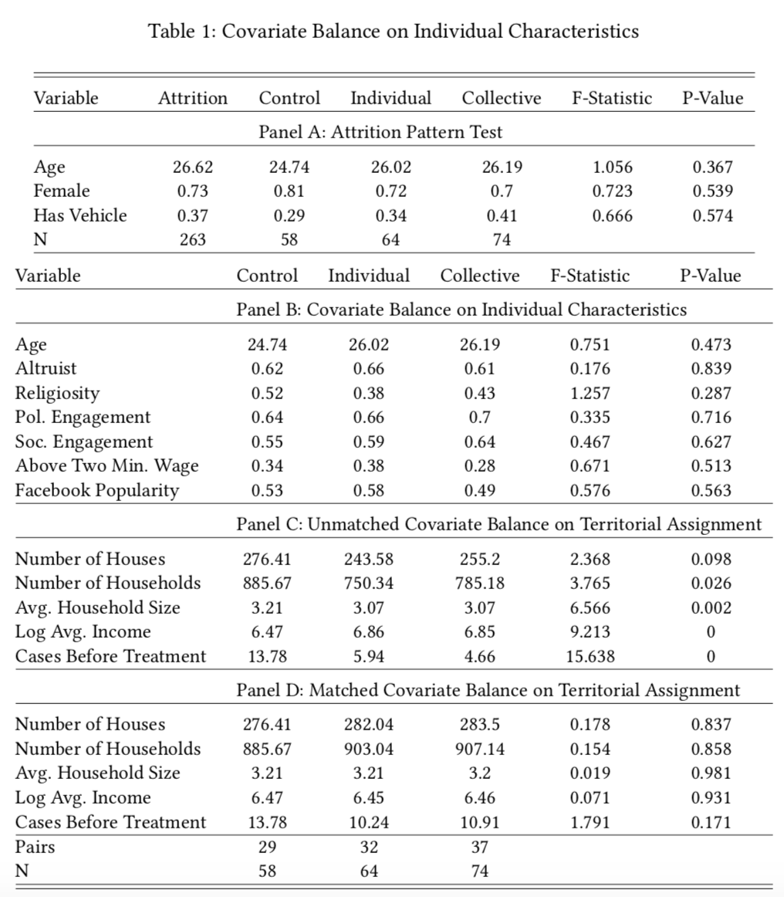
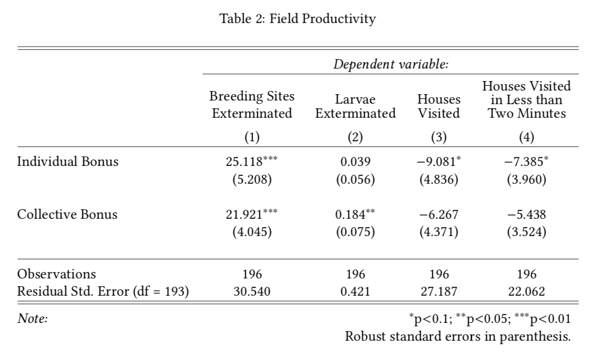
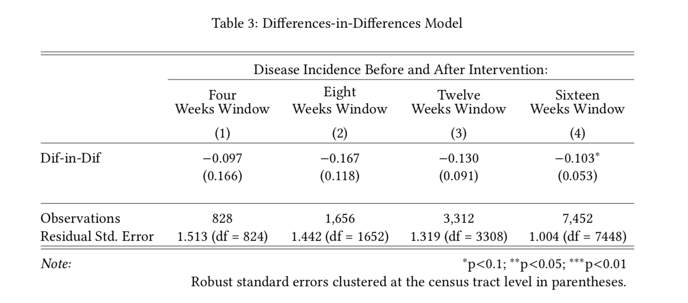
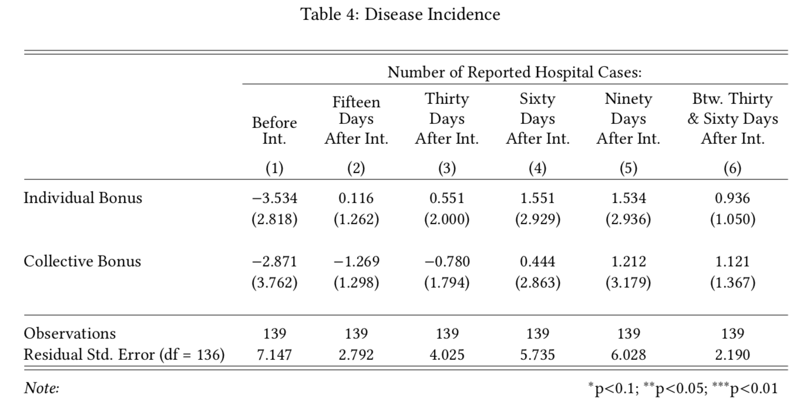

```{r xaringan-themer, include=FALSE, warning=FALSE}
options(htmltools.dir.version = FALSE)
library(xaringanthemer)
style_mono_accent(
  base_color = "#2929a3",
  header_h1_font_size = "2.25rem",
  header_h2_font_size = "1.85rem",
  header_font_google  = google_font("Bree Serif"),
  text_font_google    = google_font("Tajawal", "300", "300i"),
  text_font_size      = "1.3rem",
  code_font_google    = google_font("Fira Mono")
)
```

# Motivation

**Problem**: How do we increase healthcare worker efficiency?

**Question**: Does performance-based compensation effectively increases workers' efficiency in community-based health interventions?

Context: 

- *Aedes*-borne diseases (chikungunya, dengue, yellow fever, and Zika) continuously infect millions of people per year, creating a heavy burden for developing countries' public health systems;

- There are no safe vaccines;

- Fighting these diseases = Fighting mosquito proliferation;

- Projects target behavioral change in highly affected communities.

---

# Overview

- We evaluated whether individual and collective financial incentives improve the performance of healthcare workers fighting *A. aegypti*, as well as their effect on city-level numbers of dengue hospitalizations;

- We hired and trained subjects to visit households, find *A. aegypti* breeding sites, and eliminate mosquito larvae in the city of Rio Verde, Brazil;

- One control and two treatment groups;

- **Financial rewards** for above median individual and team performance **increase worker efficiency** in our outcomes;

- Outcomes measured: breeding sites cleaned, larvae extermination, number of households visited per minute, and dengue hospitalization incidence;

- *A. aegypti* control programmes may benefit from alternative compensation schemes, especially when provided to teams.

---

# Introduction

- Exponential increase in arboviral incidence: dengue is endemic in over 100 countries, causing 400 million infections and 22 thousand deaths each year (Bhatt et al., 2013, Center for Disease Control, 2020);

- Mosquito control is the primary strategy to prevent Aedes-borne infections;

- Inconsistent insecticide spraying and other state-led practices;

- Healthcare agencies &mdash; specifically their workers &mdash; must become more efficient;

- While the literature suggests financial incentives increase efficiency, systematic reviews indicate that important methodological shortcomings undermine the validity of these studies;

- We conduct a field experiment to put this to the test.

---

# The Intervention

- **Case choice**: Rio Verde, Goiás, Brazil (229,000 inhabitants and 1,156 confirmed dengue cases in 2017);
  
- Recruitment Ads on *Facebook* and exclusion procedures by age and attendance to training session;

- **Control Group**: Flat payment regardless of performance (BRL 110 / USD 25 per subject);

- **Individual Treatment**: We informed participants that we would rank each one of them separately and double the compensation for those who performed above the sample median (BRL 220 / USD 50 per subject);

- **Collective Treatment**: We explained that we would rank the performance of each group and double the payment for those teams whose results were higher than the sample median (BRL 220 / USD 50 per subject).

All participants worked in pairs and were aware of other groups, but they did not know about the different treatment conditions.

---

# Randomization

<center>



</center>

---

## Field Productivity

# Reporting Outcomes

Household visit procedure:
  - Participants rang the doorbell, warned about dengue fever outbreak, instructed dwellers on how to lower dengue incidence and handed them a leaflet with information about the disease;
  - If granted permission to enter the house to inspect the yard, they searched for clean breeding sites, such as pots filled with clear water, and for recipients containing larvae;
  - Upon exterminating a breeding site, subjects had to report their task by taking a photo on their cellphones;
  -  When they discovered larvae, participants had to record a short video showing the larvae before exterminating them;
  - Subjects had to take a picture of the household to account for their presence in the location.

---

## Field Productivity

# Results

<center>



</center>

---

## Field Productivity

# Results

**Breeding sites**

  - Subjects who receive monetary incentives find and clean more breeding sites than those who earned a flat compensation fee: Individual incentives work better than team incentives.


**Larvae Extermination**

  - Teams who received collective bonuses are the most effective in finding larvae: 18.4% (CI: [6.1%, 30.7%]) more likely to find larvae than those in the control group.
    - Challenging task;
    - Non-excludability.

- Subjects who received monetary incentives visited fewer houses than those who did not earn
financial rewards, and dedicated more time to each house.

---

## Dengue Incidence

# Results

What was the effect of there having been an intervention on hospitalizations for dengue in Rio Verde?

<center>



</center>

The intervention lowered dengue incidence in 10.3% (CI: [-18.9%, -1.6%]), taking both treatment groups into consideration.

---

## Dengue Incidence

# Results

How did each of the treatments affect hospitalizations for dengue in Rio Verde?

<center>



</center>

Neither treatment has an impact on disease incidence in the Rio Verde census tracts. Had there been an effect, it would be negative.

---

# Discussion

- Monetary incentives increase the productivity of community health care workers in Brazil;

- Collective incentives outperform individual performance rewards when the task is more laborious and excludable (exterminating larvae);

- The control group presented a high incidence of houses visited in less than two minutes apart from each other, which suggests that the workers may not carry their tasks as intended in the absence of incentives;

- Results compatible with education (Duflo et al, 2012) and private firms settings (Bandiera et al., 2013);

- Low city-level disease incidence effects may have taken place because the treatment was not strong enough (in length of duration or geographical breadth);

- Even though healthcare workers may be motivated, their efforts do not necessarily lead to a reduction in mosquito infections.

---

# Discussion

## Limitations

- Findings may not generalize to other locations;
- We included a post-treatment adjustment to ensure the balance of our territorial variables, which requires additional assumptions;
- Motivational messages or constant feedback may also be important forms of incentives for countries where legal or financial constraints prevent the government from distributing financial bonuses to civil servants.

## Policy Implications

Anti-mosquito campaigns require a sustained effort to guarantee their success, and we still have no robust evidence that worker productivity alone is sufficient to reduce dengue infections.

---

# Thank you!

<center>

<h2>Contact Info</h2>

<b>Umberto Mignozzetti</b>
<br>
<br>
umberto.mignozzetti@emory.edu
<br>
<br>
https://umbertomig.com

</center>


